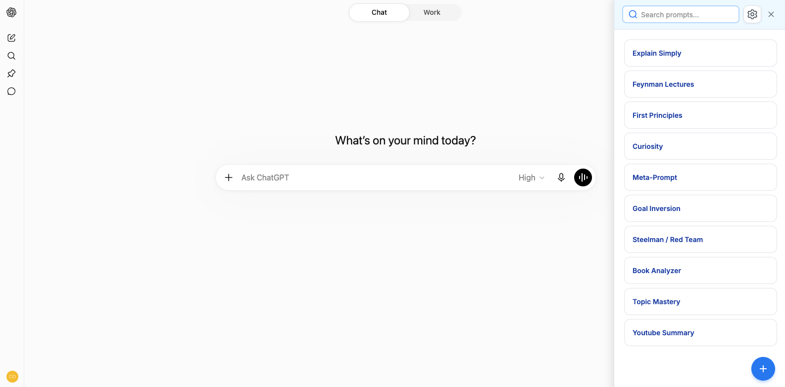

# BlitzPrompts

Personal local-only Chrome extension for saving prompts and appending them to the chatbox on ChatGPT, Claude, Gemini, and Grok.



## Features

- Store prompts locally with `chrome.storage.local`.
- Create, edit, delete, and reorder prompts.
- Fill `{{placeholders}}` before inserting a prompt.
- Append saved prompts to text already in supported AI chat editors.

## Install from source

Requires Google Chrome, npm, and Node.js 20 or 22 or newer.

```bash
npm ci
npm run build
```

Go to `chrome://extensions/`, enable **Developer mode**, click **Load unpacked**, and select the generated `dist` folder.

## Development

Use `npm run dev` to work on the popup. Run these checks before submitting a change:

```bash
npm run lint
npm run build
```

After rebuilding, reload BlitzPrompts on `chrome://extensions/` and refresh any supported chat tabs. Changes to site adapters should be manually exercised on the affected sites.

## Privacy

BlitzPrompts has no backend, accounts, analytics, or telemetry. Prompts are stored in `chrome.storage.local`, and the extension itself does not transmit them. Once a prompt is inserted into a chat editor, that text is subject to the AI provider's privacy practices.

## Contributing

Issues and pull requests are welcome. Keep changes focused, preserve the versioned prompt storage format, and keep manifest match patterns aligned with the adapters in `src/content/sites/`.

If a supported site stops working, rebuild and reload the extension first. AI chat interfaces change frequently, so a selector may need to be updated.

## Notes

- No `.env` file is required.
- Prompt data is stored locally with `chrome.storage.local`.

## License

[MIT](LICENSE)
