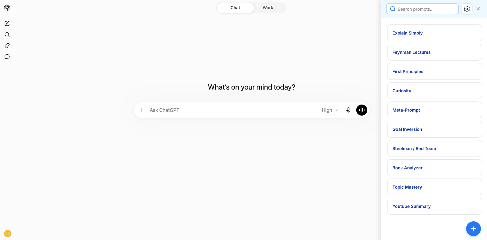

# BlitzPrompts

Personal Chrome extension for saving prompts and appending them to the chatbox on ChatGPT, Claude, Gemini, and Grok. Prompts are local by default, with optional user-owned Turso storage.



## Features

- Store prompts locally with `chrome.storage.local`.
- Optionally sync prompts to a personal Turso database while retaining a local mirror.
- Create, edit, delete, and reorder prompts.
- Fill `{{placeholders}}` before inserting a prompt.
- Append saved prompts to text already in supported AI chat editors.

## Install from source

Requires Google Chrome, npm, and Node.js 20 or 22 or newer.

```bash
npm ci
npm run build
```

Go to `chrome://extensions/`, enable **Developer mode**, click **Load unpacked**, and select the generated `dist` folder.

## Development

Use `npm run dev` to work on the popup. Run these checks before submitting a change:

```bash
npm run lint
npm run build
```

After rebuilding, reload BlitzPrompts on `chrome://extensions/` and refresh any supported chat tabs. Changes to site adapters should be manually exercised on the affected sites.

## Optional Turso storage

Local storage is enabled by default and requires no configuration. To use a personal Turso database, copy `.env.example` to `.env.local` and add the database URL and a dedicated database token:

```bash
VITE_TURSO_DATABASE_URL=libsql://database-organization.turso.io
VITE_TURSO_AUTH_TOKEN=your-database-token
```

Rebuild and reload the extension, open its toolbar popup, then choose whether to upload local prompts or restore existing Turso prompts. `.env.local` and `dist/` are ignored by Git. Vite embeds the credentials in the built background worker, so do not distribute a build containing a personal token.

## Privacy

BlitzPrompts has no developer-operated backend, accounts, analytics, or telemetry. Prompts are stored in `chrome.storage.local` by default. If the user explicitly enables Turso, prompt data is also sent to that user's configured Turso database. Once a prompt is inserted into a chat editor, that text is subject to the AI provider's privacy practices.

## Contributing

Issues and pull requests are welcome. Keep changes focused, preserve the versioned prompt storage format, and keep manifest match patterns aligned with the adapters in `src/content/sites/`.

If a supported site stops working, rebuild and reload the extension first. AI chat interfaces change frequently, so a selector may need to be updated.

## Notes

- No `.env` file is required for local-only use.
- Turso credentials belong in the gitignored `.env.local`, never in committed source.

## License

[MIT](LICENSE)
